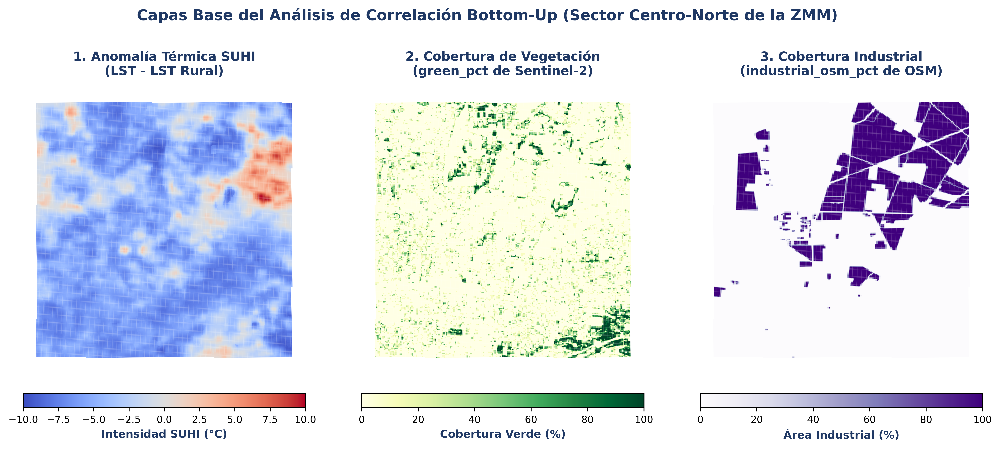

# Índice de Figuras Analíticas (SUHI de la Zona Metropolitana de Monterrey) - Versión Oficial Depurada

Este índice clasifica y describe algunas de las figuras oficiales y de avance real del proyecto que se conservan en el repositorio de manera local.

> [!NOTE]
> **Índice Parcial:** Cabe destacar que este índice solo contiene algunas figuras clave generadas directamente por el pipeline en el repositorio. Muchas otras figuras y visualizaciones del análisis están contenidas de forma exclusiva en la presentación PowerPoint privada del usuario.

---

## 1. Figuras de Contexto Espacial y Capas Base

### A. Composición de Capas de Análisis Bivariado (Diurno)
*   **Imagen:**
    
*   **Descripción:** Panel de 3 mapas paralelos que ilustran la información base del modelo espacial diurno: (1) anomalía térmica SUHI, (2) porcentaje vegetal (`green_pct` de Sentinel-2), y (3) porcentaje industrial (`industrial_osm_pct` de OSM).

### B. Mapa de Zonificación por Densidades de Suelo
*   **Imagen:**
    
*   **Descripción:** Mapa espacial de la ZMM clasificado en zonas de densidad de suelo construido según Dynamic World: Baja densidad (< 20%), Media (20-60%) y Alta ($\ge$ 60%).

### C. Zonas de Delimitación y Control Rural (Línea Base)
*   **Imagen:**
    
*   **Descripción:** Mapa espacial que delimita los tres polígonos rurales de referencia y control (Este en Pesquería, Norte en Salinas Victoria y Sur en Santiago) sobre los cuales se calculan las temperaturas rural diurna y nocturna base.

---

## 2. Análisis Espacial de Hotspots (DBSCAN)

### A. Mapa de Gradiente Completo de SUHI Diurna
*   **Imagen:**
    
*   **Descripción:** Distribución continua de la anomalía de temperatura superficial diurna sobre la totalidad de la malla fina de la Zona Metropolitana de Monterrey.

### B. Panorama General de Hotspots Diurnos (DBSCAN)
*   **Imagen:**
    
*   **Descripción:** Panorama metropolitano con los núcleos continuos de calor crítico (hotspots térmicos) detectados mediante el algoritmo DBSCAN.

### C. Mapa de Hotspots Prioritarios (Top 3)
*   **Imagen:**
    
*   **Descripción:** Delimitación de los clusters prioritarios de mayor criticidad física e intensidad de anomalía térmica superficial diurna en la ZMM.

### D. Vistas de Detalle (Zoom) de Hotspots Prioritarios
*   **Imágenes:**
    ```carousel
    
    <!-- slide -->
    
    <!-- slide -->
    
    <!-- slide -->
    
    ```
*   **Descripción:** Zoom satelital detallado de los hotspots priorizados, incluyendo la planta industrial Ternium Guerrero (Hotspot 4), ilustrando el entorno edificado y las lecturas térmicas directas.

---

## 3. Serie Temporal Histórica (Landsat 8 y 9)

### A. Serie Temporal de Temperatura Absoluta Promedio (LST) por Hotspot
*   **Imagen:**
    
*   **Descripción:** Serie de tiempo diaria y evolutiva del promedio de LST diurna en los hotspots clave del proyecto desde enero de 2025 hasta junio de 2026, ilustrando el ciclo estacional.

---

## 4. Isla de Calor Superficial Nocturna (MODIS Aqua)

### A. Mapa de la SUHI Nocturna Corregida (Malla 30m)
*   **Imagen:**
    
*   **Descripción:** Distribución espacial de la anomalía nocturna de MODIS remuestreada Nearest Neighbor a 30m, revelando el calor residual urbano a la 1:30 AM libre de distorsiones de relieve.

### B. Mapa de la SUHI Nocturna en Escala Nativa (1km)
*   **Imagen:**
    
*   **Descripción:** Mapa de anomalía térmica a las 1:30 AM en la resolución nativa de captura del sensor MODIS (1km), que sirvió para calibrar la proyección y validar el signo positivo de la anomalía.

### C. Panorama General de Hotspots Nocturnos (DBSCAN)
*   **Imagen:**
    
*   **Descripción:** Ubicación y agrupamiento de los hotspots de calor residual nocturno en la cuenca de Monterrey.
