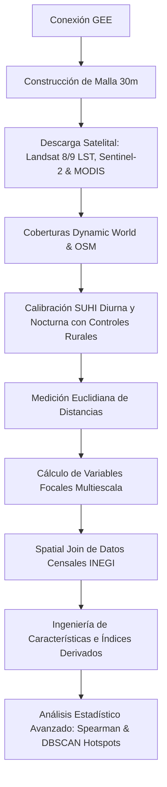

# Documento Metodológico: Pipeline de Análisis SUHI Multiescala (Diurno y Nocturno)

Este documento presenta la explicación exhaustiva y detallada de la metodología implementada en el pipeline de análisis de la Isla de Calor Urbana Superficial (SUHI) diurna y nocturna en la Zona Metropolitana de Monterrey (ZMM). El pipeline adopta un enfoque modular y paramétrico para el modelado biofísico y territorial.

---

## 1. Flujo Metodológico General

El procesamiento de datos se organiza en diez fases consecutivas, orquestadas a través de `main.py` y extendidas mediante análisis avanzados en la carpeta `scripts/`.

---

## 2. Descripción Detallada de Fases

### Fase 1: Conexión e Inicialización de Google Earth Engine
Se realiza la autenticación y conexión con la API de Google Earth Engine (GEE) para el acceso y procesamiento remoto de colecciones de imágenes diurnas y nocturnas.

### Fase 2: Construcción de la Malla de Modelado
Se genera una cuadrícula regular con una resolución espacial de $30\text{ m} \times 30\text{ m}$ ($900\text{ m}^2$ por celda) proyectada en **WGS 84 / UTM Zona 14N (EPSG:32614)**. Esta proyección métrica es indispensable para asegurar la precisión geométrica de las distancias y los buffers radiales.

### Fase 3: Descarga y Calibración Térmica, de Vegetación y Nocturna
*   **LST Diurna (Landsat 8 y 9):** Se filtra la colección de imágenes Landsat 8 y Landsat 9 Level 2 (Banda 10 TIRS) para primavera de 2026. Se aplica máscara de nubes y se calcula la LST en grados Celsius (°C) mediante algoritmos de emisividad superficial.
*   **NDVI (Sentinel-2):** Se extrae el NDVI máximo compuesto a partir de imágenes Sentinel-2 MSI. Se calcula el porcentaje de vegetación activa (`green_pct`) mapeando los subpíxeles de 10m con NDVI > 0.3 al píxel térmico de 30m.
*   **LST Nocturna (MODIS Aqua):** Se filtra la colección `MODIS/061/MYD11A1` para primavera de 2026 (captura descendente a las 1:30 AM local). Se calcula la mediana temporal sobre la banda `LST_Night_1km`, se calibra a Celsius y se exporta tanto en resolución nativa de 1 km como remuestreada a 30m (Nearest Neighbor) sin suavizados artificiales para mantener coherencia en la malla.

### Fase 4: Clasificación de Suelo y Descarga de Vectores
*   **Dynamic World:** Se descargan las fracciones de cobertura del suelo (Edificado, Árboles, Suelo Desnudo, Agua y Pasto) derivadas de la clasificación con Inteligencia Artificial del catálogo Dynamic World en GEE.
*   **OpenStreetMap (OSM):** Se descargan mediante la API Overpass los polígonos de zonificación industrial y naves industriales, así como polígonos de cuerpos de agua para el análisis de proximidad.

### Fase 5: Calibración de la SUHI (Anomalía Térmica)
Para aislar la anomalía térmica urbana diurna y nocturna, se sustrae de la LST urbana promedio la temperatura media de las tres zonas rurales de control externo (Pesquería, Salinas Victoria y Santiago):
$$\text{SUHI}_i = \text{LST}_i - \overline{\text{LST}}_{\text{rural}}$$

### Fase 6: Medición de Distancias Euclidianas
Se calculan distancias mínimas en metros desde el centroide de cada celda a polígonos industriales de OSM, a la planta Ternium Guerrero y a cuerpos de agua permanentes.

### Fase 7: Cálculo de Variables Focales Multiescala (Filtro Focal)
Para modelar la inercia y dispersión térmica en el vecindario de la celda, se aplica una convolución focal circular sobre las capas ráster originales para radios de **100m, 250m, 500m, 1000m y 3000m** antes de su extracción a la malla:
$$D_{\text{focal}}(x, y) = \frac{1}{\pi R^2} \iint_{d \le R} I(x+u, y+v) \,du\,dv$$

### Fase 8: Integración Demográfica a nivel AGEB
Se realiza un *spatial join* entre los centroides de las celdas de la malla y los polígonos de las Áreas Geoestadísticas Básicas (AGEBs) urbanas del Censo INEGI 2020. Esto agrega variables de densidad poblacional y demografía.

### Fase 9: Ingeniería de Características (Índices Sintéticos)
Se crean y normalizan (Min-Max) los índices IPU, IVT, `built_green_ratio` y `acceso_verde_capita` para capturar dinámicas territoriales complejas.

### Fase 10: Modelación y Extracción Temporal Avanzada
*   **Análisis Temporal Histórico (Landsat 8 y 9):** Se presentan las series de tiempo de LST diurna en los hotspots urbanos de Ene 2025 - Jun 2026 para caracterizar la evolución estacional.
*   **Clustering Espacial con DBSCAN:** Detección de clusters continuos de hotspots térmicos diurnos y nocturnos, priorizándolos mediante un Puntaje de Criticidad Física que pondera la intensidad de la anomalía, el tamaño del cluster y el déficit de cobertura verde.

---
